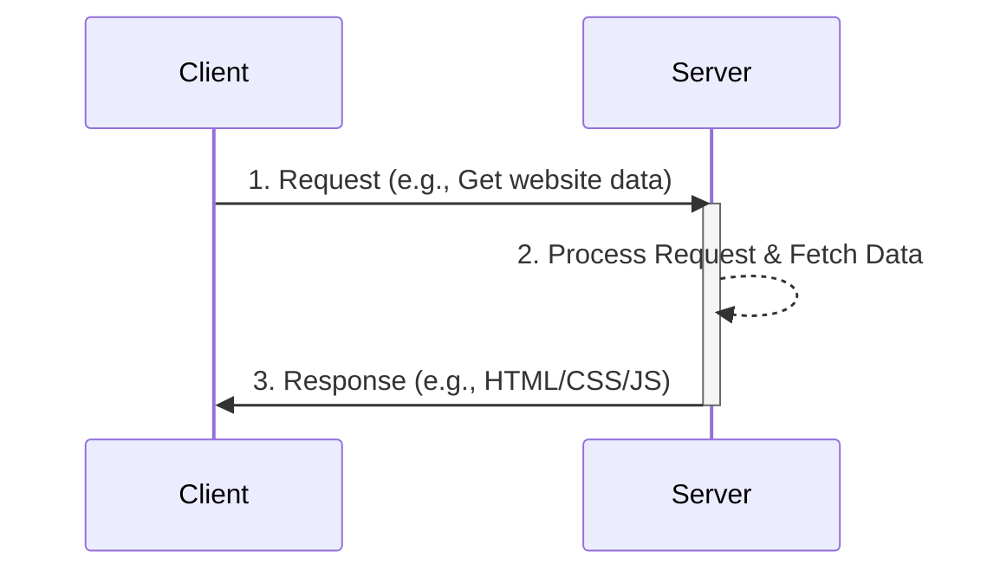
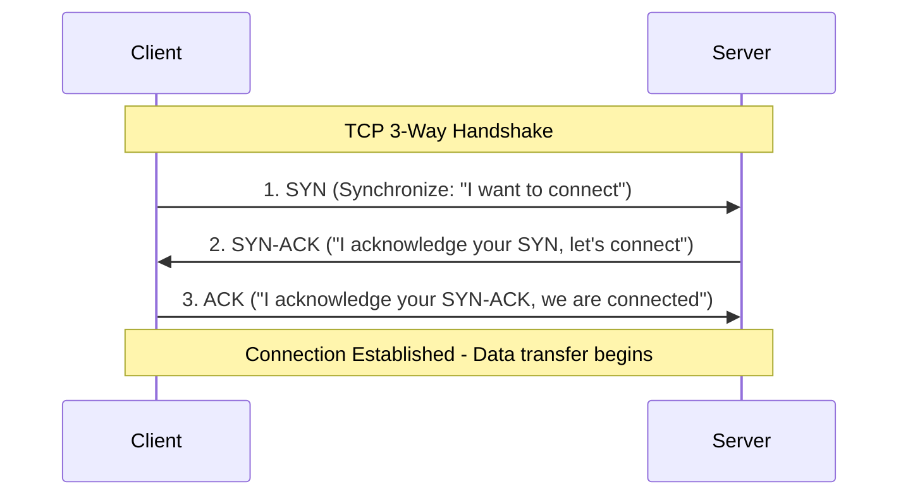
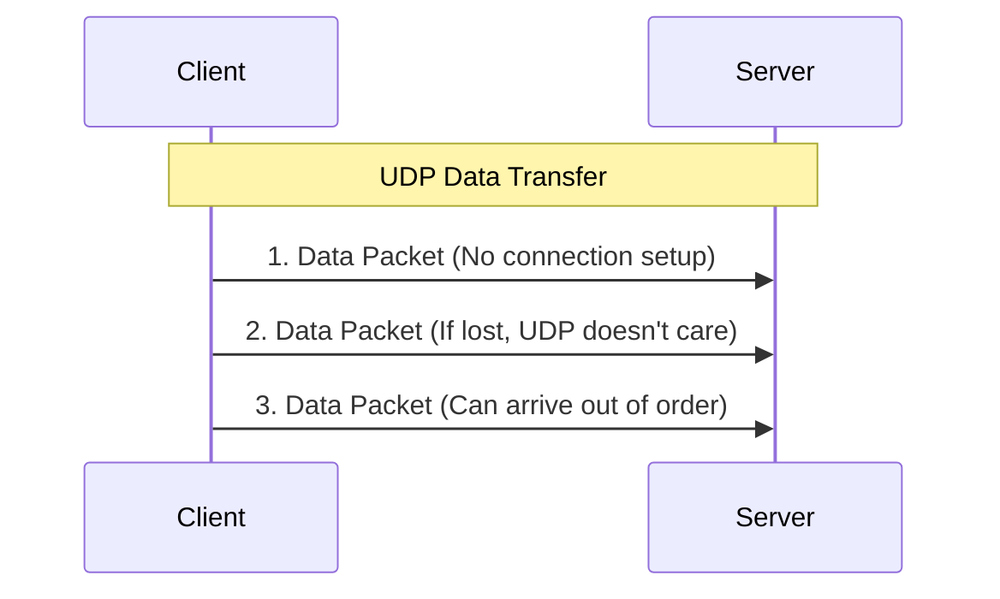
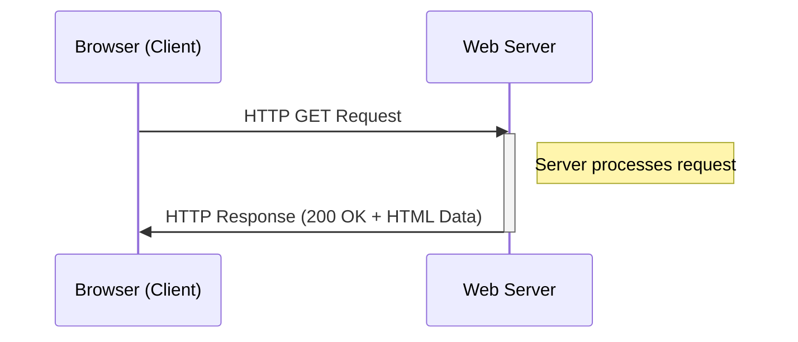
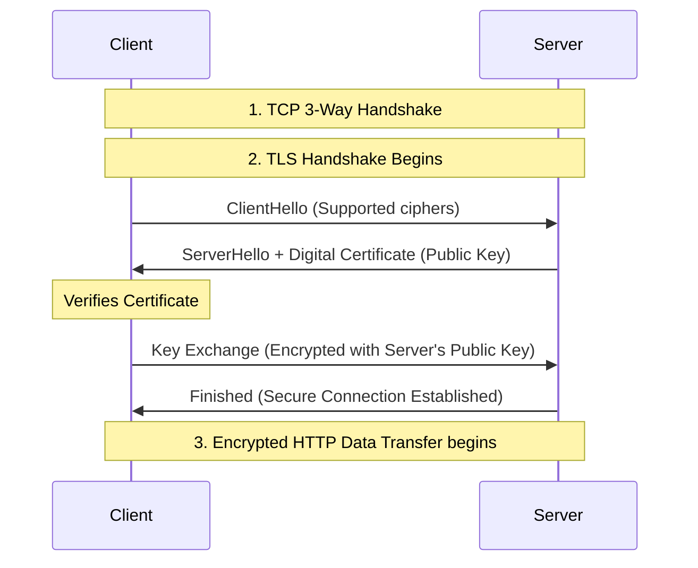

# Client-Server Architecture and Networking

## 1. Client-Server Architecture
The **Client-Server Architecture** is a distributed application structure that partitions tasks or workloads between the providers of a resource or service, called **servers**, and service requesters, called **clients**.



## 2. The TCP/IP Model vs. OSI Model
Data travels over a network using standardized conceptual models. 

*   **Application Layer:** Where applications create data to be sent (HTTP, HTTPS, DNS).
*   **Transport Layer:** End-to-end communication and data delivery (TCP, UDP). Handles ports.
*   **Internet Layer:** Routing packets across networks (IP). Handles IP Addresses.
*   **Link Layer:** Physical transmission of data (Ethernet, Wi-Fi). Handles MAC addresses.

---

## 3. Transport Layer: TCP vs. UDP

### TCP (Transmission Control Protocol)
TCP is a connection-oriented, reliable protocol. It guarantees that packets will arrive in order and without errors.

**The TCP 3-Way Handshake**
Before data is sent, TCP establishes a connection using a 3-way handshake.



**How TCP Works (Reliability):**
*   **Sequence Numbers:** Every packet gets a sequence number so the receiver can reassemble them in order.
*   **Acknowledgments (ACKs):** The receiver sends an ACK back for received packets.
*   **Retransmission:** If the sender doesn't receive an ACK within a timeout period, it retransmits the packet.

### UDP (User Datagram Protocol)
UDP is connectionless and unreliable ("fire and forget").



**Comparison**
*   **TCP:** Used for Web browsing (HTTP/HTTPS), File Transfer (FTP), Emails (SMTP). Slow but reliable.
*   **UDP:** Used for Video streaming, Online gaming, VoIP. Fast but unreliable (packet loss is acceptable).

---

## 4. Application Layer: HTTP and HTTPS

### HTTP (Hypertext Transfer Protocol)
HTTP dictates how clients and servers communicate on the web. It uses **TCP** on **Port 80**.

**HTTP Request and Response Cycle:**


**HTTP Messages and Headers**
HTTP communication relies on plain-text requests and responses. Headers are key-value pairs that provide metadata about the message.

**Example HTTP Request (Client -> Server):**
```http
GET /articles/networking HTTP/1.1
Host: www.example.com
User-Agent: Mozilla/5.0 (Windows NT 10.0; Win64; x64)
Accept: text/html,application/xhtml+xml
Accept-Language: en-US,en;q=0.5
Connection: keep-alive
```
*   `GET`: The HTTP Method. Other common methods: `POST` (create), `PUT` (update), `DELETE`.
*   `Host`: The domain being accessed.
*   `User-Agent`: Information about the client's browser and OS.
*   `Accept`: What types of content the client can understand.

**Example HTTP Response (Server -> Client):**
```http
HTTP/1.1 200 OK
Date: Mon, 05 Sep 2026 13:00:00 GMT
Server: Apache/2.4.41 (Ubuntu)
Content-Type: text/html; charset=UTF-8
Content-Length: 1245
Cache-Control: max-age=3600

<!DOCTYPE html>
<html>
... (HTML content) ...
</html>
```
*   `200 OK`: The Status Code. (200 = Success, 404 = Not Found, 500 = Server Error).
*   `Content-Type`: Tells the browser how to interpret the data (e.g., HTML, JSON, Image).
*   `Cache-Control`: Instructs the browser how long it should cache this response.

### HTTPS (Hypertext Transfer Protocol Secure)
HTTPS is HTTP but encrypted. It uses **TCP** on **Port 443**.

**The TLS/SSL Handshake**
Before any HTTP data is exchanged, a secure connection is established:

*   **Encryption:** Ensures data cannot be read if intercepted.
*   **Integrity:** Ensures data is not altered in transit.
*   **Authentication:** The Digital Certificate (issued by a Certificate Authority) proves the server is who it claims to be.
