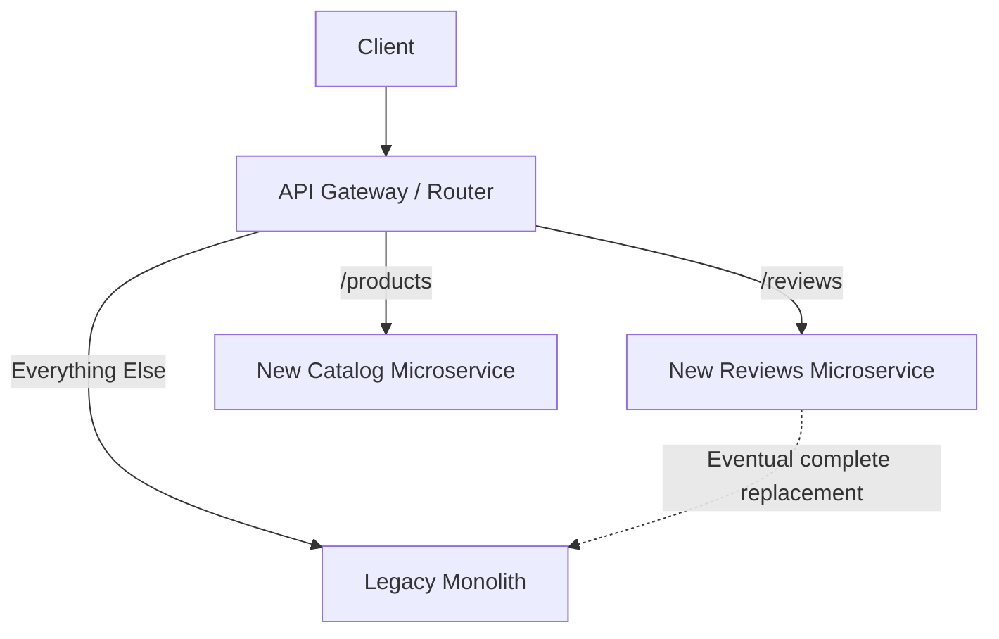

# Microservices and Migration Strategies (In-Depth)

While a Monolith puts all application logic into a single codebase and process, **Microservices Architecture** takes the opposite approach. It structures an application as a collection of loosely coupled, independently deployable services.

---

## 1. Microservices Architecture (In-Depth)

In a Microservices architecture, the application is divided into small, single-purpose services. Each service models a specific business domain (a "Bounded Context"). 

Crucially, **each microservice owns its own database**. They do not share a single massive database; instead, they communicate over a network (typically via HTTP/REST, gRPC, or message brokers like Kafka/RabbitMQ).

### The E-Commerce Example ("ShopZone" as Microservices)
If we break down our ShopZone e-commerce app into microservices:
*   **Catalog Service:** Has its own database (`catalog_db`). Handles product searches. Written in Python.
*   **Cart Service:** Has its own database (`cart_db` - maybe Redis for speed). Written in Node.js.
*   **Billing Service:** Has its own database (`billing_db`). Written in Java for strict financial typing.
*   **API Gateway:** A single entry point that receives traffic from the client and routes it to the correct microservice.

```mermaid
graph TD
    Client[Client App] --> |HTTP| Gateway[API Gateway]
    
    Gateway --> |Route /products| Catalog[Catalog Service (Python)]
    Gateway --> |Route /cart| Cart[Cart Service (Node.js)]
    Gateway --> |Route /checkout| Billing[Billing Service (Java)]
    
    Catalog --> DB1[(Catalog DB)]
    Cart --> DB2[(Cart Redis DB)]
    Billing --> DB3[(Billing DB)]
```

### Deep Dive: Advantages
1.  **Independent Scaling:** On Black Friday, you can spin up 100 instances of the Catalog Service to handle traffic spikes, while keeping the Billing Service at 2 instances. This saves massive infrastructure costs.
2.  **Technology Heterogeneity:** You can use the "best tool for the job." The AI recommendation service can be Python, the high-concurrency cart can be Go, and the legacy billing can remain Java.
3.  **Fault Isolation (Blast Radius):** If a bug causes the Catalog Service to crash, customers can still log in and view their previous orders via the User Service. The entire site doesn't go down.
4.  **Independent Deployments:** A team of 5 developers can deploy an update to the Cart Service in 3 minutes without waiting for or risking the rest of the application.

### Deep Dive: Disadvantages & Complexity
1.  **Distributed System Complexity:** Network calls are slow and can fail. You must implement retries, circuit breakers, and timeouts.
2.  **Data Consistency:** Since databases are split, you can no longer use simple ACID SQL transactions to update an order and a user's balance simultaneously. You must use complex patterns like **Two-Phase Commit** or the **Saga Pattern** for distributed transactions.
3.  **Operational Overhead:** You now have 50 services to monitor instead of 1. You need complex infrastructure like Kubernetes, distributed tracing (e.g., Jaeger), and centralized logging (e.g., ELK stack) just to see what is happening.

---

## 2. Modular Techniques (The Modular Monolith)

Moving from a Monolith straight to Microservices is often a recipe for disaster (resulting in a "Distributed Monolith" where services are still tightly coupled but now suffer from network latency). 

A better intermediate step (or permanent solution) is the **Modular Monolith**.

### How it Works
A Modular Monolith is deployed as a single application (just like a standard monolith), but the codebase is strictly segregated into independent modules (e.g., Billing, Shipping, Catalog).
*   **Strict Boundaries:** Modules cannot directly access each other's databases or internal variables. 
*   **Communication via API:** If the Billing module needs user data, it cannot write a SQL query against the `users` table. It must call a public method exposed by the User module's interface (e.g., `UserService.getUser()`).

**Why do this?** It provides the simplicity of deploying a single application, the high performance of in-memory method calls, *and* enforces the clean separation of concerns required for Microservices. If you ever *do* need to extract the Billing module into a true Microservice later, the boundaries are already perfectly drawn.

---

## 3. The Strangler Fig Pattern (Migration Technique)

When a company has a massive, legacy Monolith and wants to move to Microservices, rewriting the entire application from scratch is incredibly risky (the "Big Bang Rewrite" almost always fails).

Instead, architects use the **Strangler Fig Pattern**. Named after the Strangler Fig tree (which grows around an existing tree, eventually replacing it), this pattern involves incrementally replacing pieces of the monolith with new microservices.

### Step-by-Step Execution
1.  **Introduce an API Gateway:** Place a proxy (like NGINX or AWS API Gateway) in front of the legacy Monolith. Initially, the Gateway routes *all* traffic to the Monolith.
2.  **Build a New Microservice:** Choose one small, low-risk piece of functionality (e.g., "User Reviews") and build it as a brand new Microservice with its own database.
3.  **Update the Gateway (Strangulation):** Configure the API Gateway so that any traffic going to `/reviews` is routed to the new Microservice. All other traffic continues to go to the Monolith.
4.  **Repeat:** Slowly, over months or years, extract more features (Billing, Catalog, etc.) into microservices and update the Gateway routing. 
5.  **Decommission:** Eventually, the Monolith handles no traffic at all. It has been completely "strangled" and can be safely deleted.


