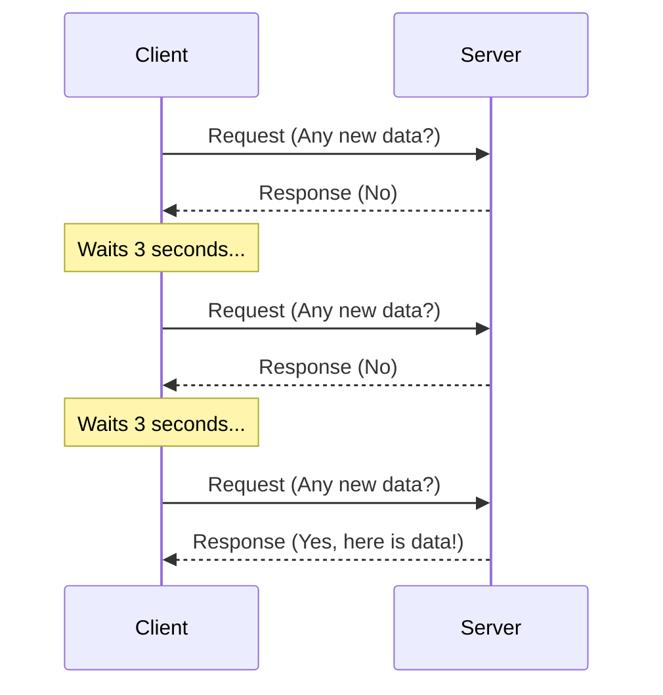
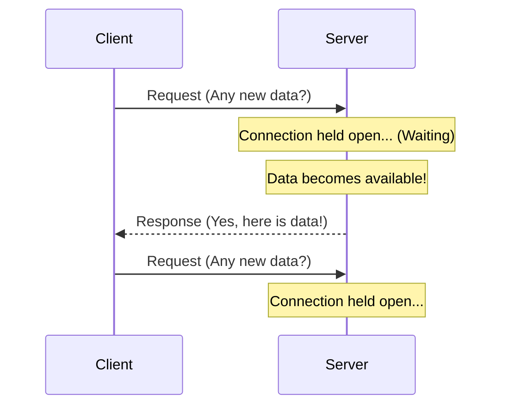
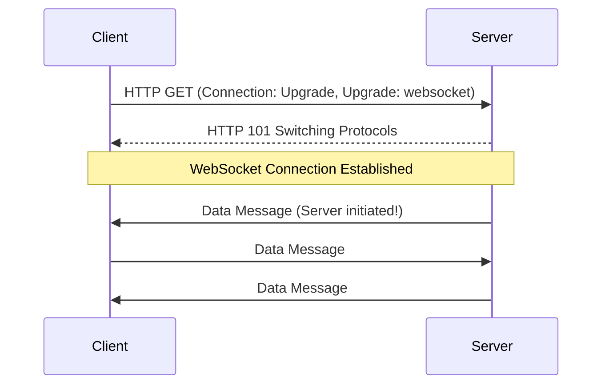
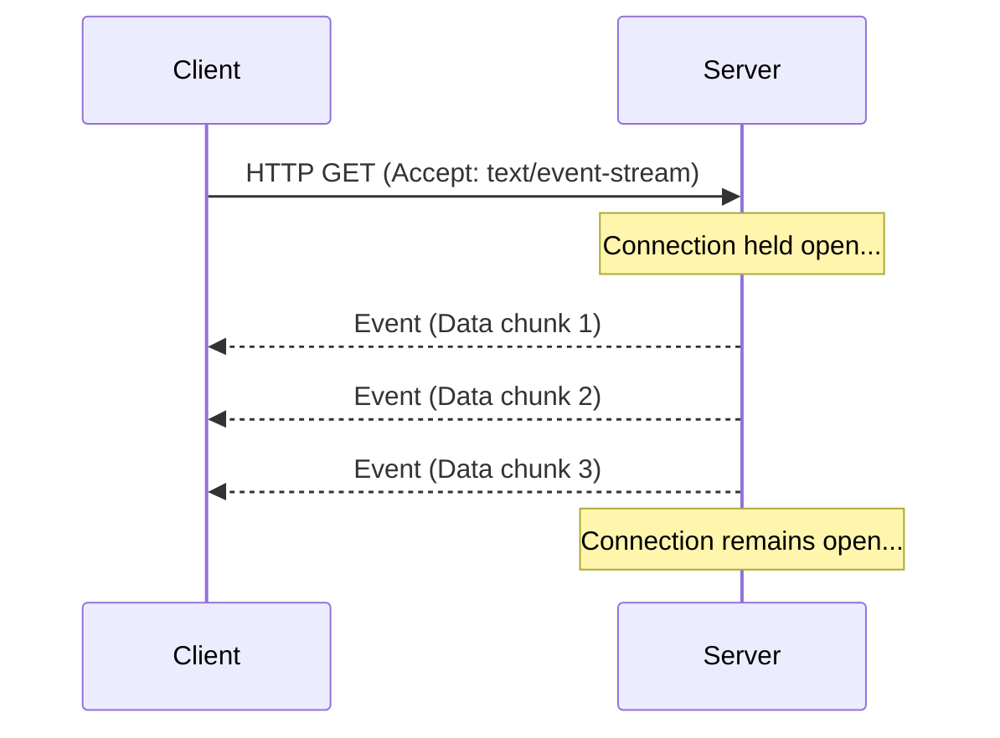

# Real-Time Networking: Polling, WebSockets, and SSE

In a traditional Client-Server model (like standard HTTP), the client must request data from the server. The server cannot initiate contact with the client. However, modern applications (chat apps, live sports scores, trading dashboards) require **real-time** data.

To solve this, several techniques were developed: Short Polling, Long Polling, WebSockets, and Server-Sent Events (SSE).

---

## 1. Short Polling (Regular Polling)

**How it works:** The client repeatedly asks the server for new data at regular, fixed intervals (e.g., every 3 seconds). If the server has new data, it responds with it. If not, it returns an empty response.

*   **Pros:** Very simple to implement. Works over standard HTTP.
*   **Cons:** Highly inefficient. Creates massive network overhead and server load because the vast majority of requests return empty (wasted bandwidth).
*   **Use Cases:** Simple applications where immediate real-time updates aren't critical, or legacy systems.

---

## 2. Long Polling

**How it works:** The client requests data from the server. If the server has no new data, it **holds the connection open** until data becomes available (or a timeout occurs). Once data is available, the server responds, closing the connection. The client then immediately opens a *new* long-polling request.

*   **Pros:** Much more efficient than short polling because it eliminates empty responses. Updates feel instantaneous to the user.
*   **Cons:** Still uses standard HTTP requests (headers overhead). If data updates frequently, it degrades back into short polling but with the added overhead of establishing a new connection every time.
*   **Use Cases:** Chat applications, notification systems where updates are intermittent.

---

## 3. WebSockets

**How it works:** WebSockets provide a **persistent, full-duplex (two-way) communication channel** over a single TCP connection. It starts as a standard HTTP request, but the client asks to "upgrade" the connection to a WebSocket. Once upgraded, both the client and server can send messages to each other independently at any time.

*   **Pros:** 
    *   **True real-time:** Lowest latency possible.
    *   **Bi-directional:** Client and server can both push data simultaneously.
    *   **Low overhead:** After the initial handshake, messages don't carry HTTP headers, making data frames very small.
*   **Cons:** Harder to scale (requires maintaining persistent stateful connections). Load balancers require special configuration.
*   **Use Cases:** Multiplayer gaming, collaborative editing (Google Docs), live trading platforms, fast-paced chat apps.

---

## 4. Server-Sent Events (SSE)

**How it works:** SSE allows the server to push updates to the client over a **single, long-lived HTTP connection**. Unlike WebSockets, SSE is **uni-directional** (Server -> Client only). The client cannot send messages back over this channel (it must use regular HTTP POST/PUT requests for that).

*   **Pros:** 
    *   Built on top of standard HTTP (easy to proxy/load balance).
    *   Built-in support for auto-reconnection and message tracking (Event IDs).
    *   Lighter than WebSockets if you only need one-way data.
*   **Cons:** Uni-directional. Limited maximum open connections per browser (historically 6 per domain, though HTTP/2 fixes this).
*   **Use Cases:** Live news feeds, social media timelines, live sports scores, system health dashboards.

---

## Summary Comparison

| Feature | Short Polling | Long Polling | WebSockets | SSE (Server-Sent Events) |
| :--- | :--- | :--- | :--- | :--- |
| **Direction** | Uni-directional | Uni-directional | Bi-directional | Uni-directional (Server to Client) |
| **Protocol** | HTTP | HTTP | WS/WSS (Upgraded HTTP) | HTTP |
| **Connection** | New request every X sec | New request after response | Single persistent TCP | Single persistent HTTP |
| **Overhead** | Very High | Medium | Very Low (after handshake) | Low |
| **Best For** | Legacy/Simple apps | Intermittent updates | Multiplayer games, fast chat | Live feeds, dashboards, notifications |
